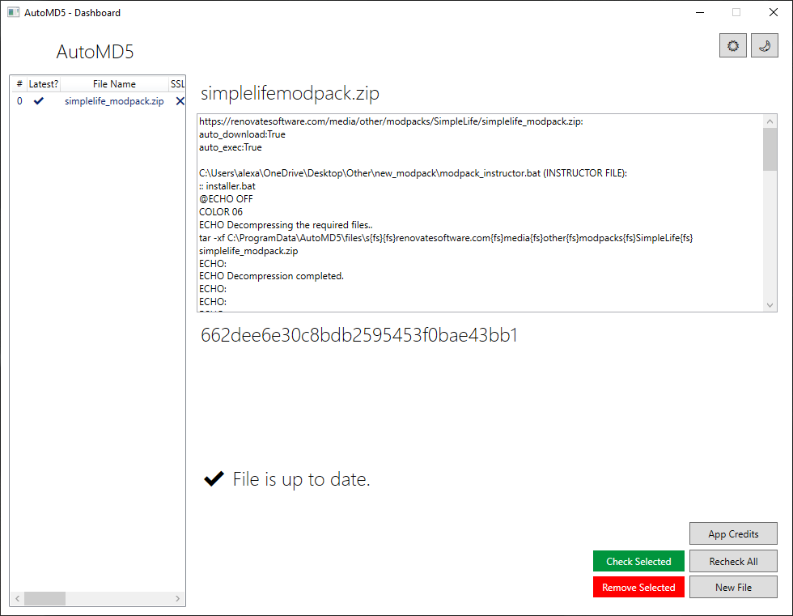

# AutoMD5
An opensource automatic MD5 file checker that downloads a new file if the MD5 hash has changed. Built for deployment with the .Net Runtime Framework 4.7.2.

## To-Do List
- [x] Core functionality.
- [ ] Add additional functionality for instructor files.
- [ ] Implement use of auto_execute and auto_download.
